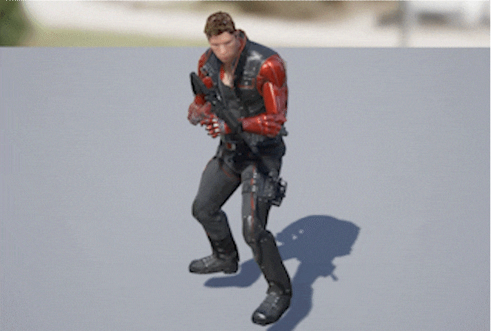

# 스켈레톤 서바이벌
스켈레톤 서바이벌 문서입니다.

 
 

# 1. 프로젝트 소개
  ### 프로젝트 개요
  - 뱀파이어 서바이벌에서 영감을 받아 제작된 스켈레톤 서바이벌입니다.
  - 몬스터를 쓰러뜨려 레벨업을 하면서 플레이어가 성장하고 정해진 웨이브 내를 최대한 빨리 깨는 것이 목표인 게임입니다.

 
 
 
  
  ### 개발 인원
  - 현정민(1인)
  
 
 
 

  ### 사용 기술
  - 언리얼 엔진(c++과 블루 프린트)
  - 블랜더(모델링 수정)

  
  
  
  

 

# 2. 핵심 기능
  ### 플레이어
  - #### 플레이어 스탯
    
      - 체력
      - 체력 재생
      - 이동 속도
      - 총알 공격력
      - 총알 발사 속도(fire rate)
      - 총알 속도(bullet speed)
      - 경험치

     
     
    
  - #### 레벨업 기능
    
    
     
      -경험치 달성 시 레벨업 UI 팝업창이 나옵니다.
     
      -총 3가지 선택지가 레벨업할 때마다 랜덤으로 나오고 그 선택지에 적힌 스탯이 증가합니다.
        
     
     
     
    
  - #### 총
      - _Ar 4_
    

     
     
     
    
      - _총알사진_
    

     
     
     
    
      - _발사 시 효과_
    
     
      -총알 발사 시 총구에서 연기가 나오고 총알의 궤적을 따라 빨간 레이저 선이 그려집니다.

     
     
     
     
    
  - #### 애니메이션
    
      - _이동 애니메이션_
    
     
      -블랜드 스페이스를 통해 속도와 이동 방향에 따라서 움직이는 애니메이션을 다르게 표현하였습니다.

     
     
     
    
      - _발사 애니메이션_
    
     
      -나이아가라 시스템을 이용해 총 발사 시 연기 효과와 총알의 트레일을 표현하였습니다.

     
     
     
    
      - _피격 애니메이션_
    
     
      -몽타주를 통해서 이동 애니메이션 중에서도 애니메이션 재생이 가능합니다.

     
     
     

      - _죽음 애니메이션_
    
    
     
     

    ---

  ### 적
  - #### 적 스탯
    
      - 체력
      - 데미지
      - 이동 속도
      - 공격 속도
      - 피격 속도
    
     
     
    
  - #### 적 종류

      - _[기본]_
    
     
      -가장 기본적인 적입니다.
     
      -평균적인 체력과 데미지, 이동속도를 갖고 경험치는 가장 낮게 줍니다.

     
     
     

      - _[빠른 적]_
    
     
      -빠른 적입니다.
     
      -이동 속도가 빠르지만 체력이 낮습니다. 기본 적보다 경험치를 많이 줍니다.

     
     
     

      - _[무거운 적]_
    
     
      -갑옷을 입은 적입니다.
     
      -이동 속도가 느리지만 체력이 많고 피격시 딜레이가 가장 적습니다. 빠른 적보다 경험치를 많이 줍니다.

     
     
     
     
    
  - #### 적 FSM(상태 머신)

    
     
    -적의 행동은 상태 머신으로 구현하였습니다.
     
    -EEnemyState라는 열거형 변수를 만들어 EnemyFSM 액터 컴포넌트에서 프레임마다 현재 EEnemyState의 값을 확인하면서 적의 행동이 변합니다.

     
     
     
    
      - _기본 상태_
    
     
    -스켈레톤이 스폰된 후 일정시간 동안 Idle 상태에 머뭅니다. 그 후 Move 상태로 전환됩니다.

     
     
     
    
      - _이동 상태_
    
     
    -스켈레톤이 플레이어를 향해 이동합니다. 플레이어가 공격 범위 안에 들어오면 Attack 상태로 전환됩니다.

     
     
     
    
      - _공격 상태_
    
     
    -스켈레톤이 플레이어를 향해 공격합니다. 팔을 뻗는 동작에 Anim_Notify가 발생하고 이 시점에 공격이 플레이어에게 닿았다면 플레이어에게 데미지를 줍니다.
     
    -플레이어가 그대로 공격범위 안에 있으면 공격을 다시하고, 공격범위에서 벗어났다면 Move 상태로 돌아갑니다.

     
     
     

      - _피격 상태_
    
     
    -스켈레톤의 Damage 상태입니다. 플레이어의 총알이 스켈레톤에 닿으면 EEnemyState를 Damage로 바꾸어 상태를 Damage로 바꿉니다.
     
    -Damage 애니메이션이 끝나면 Anim_Notify가 발생하고 EenemyState를 Idle로 바꿉니다.

     
     
     
    
      - _죽음 상태_
    
     
    -Damage를 체크할 때 체력이 0이하가 된다면 죽음 상태가 됩니다.
     
    -죽음과 동시에 플레이어에게 경험치를 주고 죽는 애니메이션이 끝나면 객체를 Destroy하고 UI에 표시되는 현재 남아있는 스켈레톤 수를 1 줄입니다.

     
     
     
     

# 3. 플레이 영상
[플레이 영상](https://youtu.be/5UMjmZaq4GM)
      
